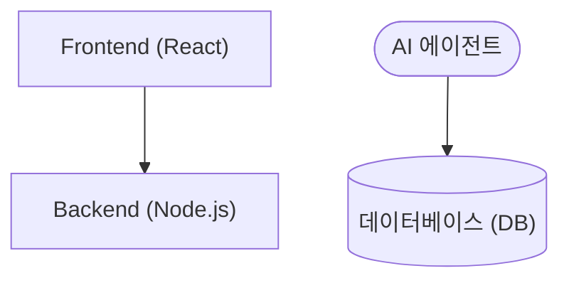

# Mermaid 다이어그램 작성 규칙 (Harness)

이 규칙은 AI 에이전트가 Markdown 내에 Mermaid 다이어그램을 작성할 때 발생하는 파싱 오류를 방지하기 위한 강제 지침(Harness)입니다.

## 규칙: 노드 레이블의 큰따옴표 래핑 강제

Mermaid에서 노드(Node) 이름, 라벨(Label), 내용 등에 다음과 같은 문자가 하나라도 포함될 경우, **반드시 큰따옴표(`" "`)로 전체 레이블을 묶어주어야 합니다.**

- 괄호 `()`, `{}`, `[]`
- 슬래시 `/`
- 하이픈 `-`
- 공백 ` ` (스페이스)
- 기타 Mermaid 파서에서 형태(Shape)를 정의하는 데 사용되는 모든 특수문자

### 올바른 예시 (O)


### 잘못된 예시 (X) - 파싱 에러 발생
```mermaid
flowchart TD
    A[Frontend (React)] --> B[Backend (Node.js)]
    C([AI 에이전트]) --> D[(데이터베이스 (DB))]
```

## 에이전트 준수 사항
이후부터 모든 다이어그램을 생성하거나 수정할 때, 노드 내 텍스트를 작성할 때는 무조건 큰따옴표로 감싸는 방식을 기본값으로 채택하여 파싱 에러(예: `Expecting 'SQE', ... got 'PS'`)의 원천 차단을 보장해야 합니다.
