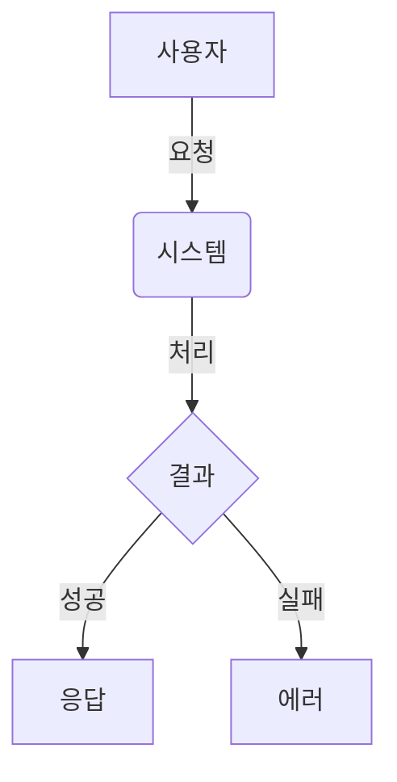

# Feature Specification: [FEATURE NAME]

**Confluence Link**: `[LINK_TO_CONFLUENCE]`  
**JIRA Epic/Ticket**: `[JIRA_TICKET_ID]`  
**Feature Branch**: `[###-feature-name]`  
**Created**: [DATE]  
**Status**: Draft  
**Input**: User description: "$ARGUMENTS"

> **Note**: 본 문서는 `tdecollab-docs/specs/[###-feature-name]/spec.md`에 저장됩니다. 헌장에 따라 설계 과정에서 Mermaid 다이어그램과 표를 적극적으로 활용하십시오.

## User Scenarios & Testing *(mandatory)*

### User Story 1 - [Brief Title] (Priority: P1)

[Describe this user journey in plain language]

**Why this priority**: [Explain the value and why it has this priority level]

**Independent Test**: [Describe how this can be tested independently]

**Acceptance Scenarios**:

1. **Given** [initial state], **When** [action], **Then** [expected outcome]

---

## 시각화 및 설계 (Visualization & Design)

<!-- 
  헌장 IV 원칙에 따라 Mermaid 다이어그램을 사용하여 흐름이나 구조를 시각화하십시오. 
  예: Sequence Diagram, Flowchart, Class Diagram 등
-->

## Requirements *(mandatory)*

### Functional Requirements

- **FR-001**: 시스템은 [기능]을 수행해야 한다. (MUST)

### Key Entities *(include if feature involves data)*

| 엔티티 | 설명 | 주요 속성 |
|--------|------|-----------|
| [Entity 1] | [설명] | [속성 1, 속성 2] |

## Success Criteria *(mandatory)*

### Measurable Outcomes

- **SC-001**: [측정 가능한 목표, 예: 응답 시간 200ms 이내]

## Assumptions

- [가정 사항 1]
- [가정 사항 2]
