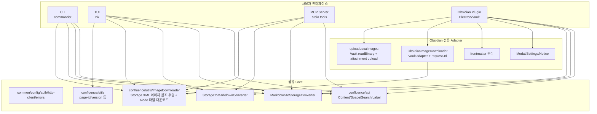
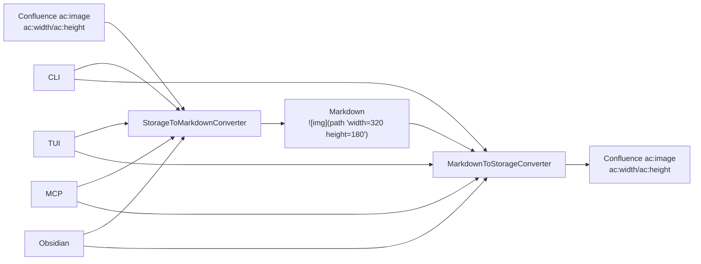

# tdecollab 아키텍처

## 1. 프로젝트 개요

### 1.1 목적 및 배경
- TDE 포털의 Confluence, JIRA, GitLab을 CLI 및 MCP 서버로 통합 제공
- 기존 aicc-pm 프로젝트(Python, Confluence 전용)의 기능을 확장하여 3개 서비스 통합 지원
- AI 에이전트(Claude 등)가 TDE 협업 도구를 직접 활용할 수 있도록 MCP 프로토콜 지원

### 1.2 TDE 포털 서비스 연동 범위
- Confluence (Server/DC): 페이지 CRUD, Markdown 변환, 검색, 라벨, 트리 조회
- JIRA (Server/DC): 이슈 CRUD, JQL 검색, 트랜지션, 코멘트, 프로젝트/보드
- GitLab (Self-hosted): 프로젝트, MR, 파이프라인, 브랜치, 파일 조회

## 2. 시스템 아키텍처

### 2.1 전체 구조 다이어그램 (텍스트)
```
┌─────────────────────────────────────────────────────────┐
│                       tdecollab                         │
├─────────────────────────────────────────────────────────┤
│                                                         │
│  ┌──────────┐   ┌────────────┐   ┌──────────────────┐  │
│  │   CLI    │   │ MCP Server │   │ (향후) HTTP API  │  │
│  │(commander│   │(McpServer  │   │                  │  │
│  │  기반)   │   │ + stdio)   │   │                  │  │
│  └────┬─────┘   └─────┬──────┘   └──────────────────┘  │
│       │               │                                 │
│       ▼               ▼                                 │
│  ┌──────────────────────────────────────────────────┐   │
│  │           Tools / Commands 레이어                 │   │
│  │ confluence/tools  jira/tools   gitlab/tools       │   │
│  │ confluence/cmds   jira/cmds    gitlab/cmds        │   │
│  └──────────────────────┬───────────────────────────┘   │
│                         │                               │
│                         ▼                               │
│  ┌──────────────────────────────────────────────────┐   │
│  │           API Client 레이어                       │   │
│  │ confluence/api     jira/api     gitlab/api        │   │
│  └──────────────────────┬───────────────────────────┘   │
│                         │                               │
│                         ▼                               │
│  ┌──────────────────────────────────────────────────┐   │
│  │           공통 인프라 (common/)                    │   │
│  │ config   auth   http-client   errors   logger     │   │
│  └──────────────────────┬───────────────────────────┘   │
└─────────────────────────┼───────────────────────────────┘
                          │
          ┌───────────────┼───────────────┐
          ▼               ▼               ▼
    ┌──────────┐   ┌──────────┐   ┌──────────┐
    │Confluence│   │  JIRA    │   │  GitLab  │
    │ REST API │   │ REST API │   │ REST API │
    │(Server)  │   │(Server)  │   │  (v4)    │
    └──────────┘   └──────────┘   └──────────┘
```

### 2.2 레이어 구성
각 서비스 모듈은 3개 레이어로 구성되며, 상위 레이어가 하위 레이어에 의존하는 단방향 구조.

1. **API Client 레이어** (`api/`): 순수한 REST API 호출 레이어. HTTP 요청/응답만 담당하며 재사용성이 높음. 서비스별 API 클라이언트 클래스와 리소스별 함수로 구성.

2. **Tools/Commands 레이어** (`tools/`, `commands/`): 인터페이스 레이어. MCP 도구는 Zod 스키마 기반 입출력 검증을 포함하고, CLI 커맨드는 commander 서브커맨드로 등록. 양쪽 모두 API Client 레이어를 호출하여 결과를 각자의 포맷으로 래핑.

3. **공통 인프라** (`common/`): 인증, HTTP 클라이언트, 설정 관리, 에러 타입, 로거 등 모든 모듈이 공유하는 기반 코드.

### 2.3 데이터 흐름

**MCP 요청 흐름:**
```
Claude → stdio → McpServer → tool-registry → confluence/tools/get-page
  → confluence/api/content.getPage() → common/http-client → Confluence REST API
  → 응답 → MCP 응답 형식으로 변환 → stdio → Claude
```

**CLI 요청 흐름:**
```
사용자 → tdecollab confluence page get 12345
  → commander 파싱 → confluence/commands/page.get()
  → confluence/api/content.getPage() → common/http-client → Confluence REST API
  → 응답 → 터미널 출력 형식으로 포매팅 → stdout
```

### 2.4 CLI/TUI/MCP/Obsidian 코드 관계

tdecollab은 하나의 core 구현을 여러 interface가 호출하는 구조를 목표로 한다. 다만 각 interface의 실행 환경이 다르기 때문에 UI, 파일 I/O, binary 처리, 사용자 feedback은 interface별 adapter 코드로 분리되어 있다.



#### 공유되는 코드

| 기능 | 공유 모듈 | 사용하는 interface | 비고 |
|---|---|---|---|
| Confluence REST API 호출 | `tools/confluence/api/*` | CLI, TUI, MCP, Obsidian | HTTP 요청/응답 모델 공유 |
| Markdown → Confluence Storage XML | `tools/confluence/converters/md-to-storage.ts` | CLI, TUI, MCP, Obsidian | frontmatter 제거, image filename decode, image size 복원 등이 모두 여기에 적용 |
| Confluence Storage XML → Markdown | `tools/confluence/converters/storage-to-md.ts` | CLI, TUI, MCP, Obsidian | list indent, macro, image size metadata 보존 등이 모두 여기에 적용 |
| 설정/인증/HTTP client | `tools/common/*` | CLI, TUI, MCP, Obsidian 일부 | Obsidian은 UI settings에서 받은 값을 `createConfluenceClient`에 직접 전달 |
| 페이지 ID/version 유틸 | `tools/confluence/utils/*` | CLI, TUI 중심 | URL page id 정규화, update version 계산 |
| Storage XML 이미지 참조 추출 | `tools/confluence/utils/image-downloader.ts` | CLI, TUI, MCP, Obsidian 일부 | Obsidian은 download binary/write 부분만 별도 처리하고 참조 추출은 재사용 |

#### Interface별 전용 코드

| interface | 전용 코드 | 이유 |
|---|---|---|
| CLI | `tools/confluence/commands/*` | commander option parsing, stdout 출력, Node filesystem 사용 |
| TUI | `tools/tui/*` | Ink 화면 상태, form 입력, 단계별 log 표시 |
| MCP | `tools/confluence/tools/*` | Zod schema, MCP 응답 wrapper |
| Obsidian | `packages/obsidian-plugin/src/*` | Obsidian Modal/Notice/Settings, Vault adapter, `requestUrl`, frontmatter property 관리 |

#### 중복 또는 개선 여지가 있는 코드

현재 core 변환 로직은 공유되고 있지만, 아래 영역은 interface별 구현이 일부 중복되어 있다.

| 영역 | 현재 상태 | 개선 방향 |
|---|---|---|
| 로컬 이미지 attachment upload | CLI는 command 내부에서 Node `fs`로 처리, Obsidian은 `uploadLocalImages`로 Vault 처리 | 공통 attachment upload service + filesystem/vault adapter 분리 |
| 이미지 binary download | CLI/TUI는 `ImageDownloader`가 Node filesystem에 저장, Obsidian은 `ObsidianImageDownloader`가 Vault에 저장 | 참조 추출/다운로드 정책/파일명 정책을 core service로 올리고 저장소만 adapter화 |
| create/update orchestration | CLI/TUI/Obsidian이 각각 page fetch, convert, upload 순서를 구현 | `ConfluencePageSyncService` 같은 application service로 통합 가능 |
| user feedback | CLI stdout, TUI log state, Obsidian Notice가 각각 필요 | 이 부분은 interface 전용으로 유지하는 것이 적절 |

#### 최근 image size roundtrip 변경의 적용 범위

`tdecollab-docs/plans/2026-05-03-010-confluence-image-size-roundtrip.md` 작업은 shared converter에 적용되었다.



따라서 Obsidian plugin 쪽에 별도 image size 전용 코드를 추가할 필요는 없다. Obsidian plugin의 `downloadPage()`와 `uploadMarkdown()`이 각각 `StorageToMarkdownConverter`, `MarkdownToStorageConverter`를 직접 사용하기 때문이다. 단, Obsidian에서 이미지 파일을 실제 Vault에 저장하거나 읽어서 attachment로 올리는 동작은 `ObsidianImageDownloader`, `uploadLocalImages`가 담당하므로 이 부분은 plugin 전용 adapter 코드가 계속 필요하다.

## 3. 모듈 구조

### 3.1 common - 공통 인프라
| 파일 | 역할 |
|------|------|
| `config.ts` | dotenv 기반 환경변수 로딩, 서비스별 설정 타입 정의, 유효성 검증 |
| `auth.ts` | Basic Auth (Confluence/JIRA), Token Auth (GitLab) 매니저 |
| `http-client.ts` | axios 인스턴스 팩토리. baseURL, 인증 헤더 자동 주입, 에러 인터셉터 |
| `errors.ts` | ApiError, AuthError, NotFoundError 등 공통 에러 클래스 |
| `types.ts` | PaginatedResult, ServiceConfig 등 공통 인터페이스 |
| `logger.ts` | 로그 레벨 기반 로거 (debug, info, warn, error) |

### 3.2 confluence - Confluence 연동 모듈
- `api/`: 콘텐츠(페이지) CRUD, 스페이스 조회, CQL 검색, 라벨 관리 API
- `tools/`: MCP 도구 9개 (get_page, create_page, update_page, delete_page, search_pages, get_page_tree, get_spaces, manage_labels, convert_content)
- `converters/`: Markdown→Confluence Storage HTML 변환, 역변환
- `commands/`: CLI 커맨드 (page, space, search, label, convert)

### 3.3 jira - JIRA 연동 모듈
- `api/`: 이슈 CRUD, JQL 검색, 트랜지션, 코멘트, 프로젝트/보드 API
- `tools/`: MCP 도구 7개 (get_issue, create_issue, update_issue, search_issues, transition_issue, manage_comments, get_projects)
- `commands/`: CLI 커맨드 (issue, search, comment, project, board)

### 3.4 gitlab - GitLab 연동 모듈
- `api/`: 프로젝트, MR, 파이프라인, 브랜치, 저장소 파일 API
- `tools/`: MCP 도구 7개 (get_project, get_merge_request, create_merge_request, manage_merge_request, get_pipelines, manage_branches, get_file)
- `commands/`: CLI 커맨드 (project, mr, pipeline, branch, file)

### 3.5 mcp - MCP 서버 코어
- `server.ts`: McpServer 인스턴스 생성, 서버 메타데이터 설정
- `tool-registry.ts`: 3개 모듈의 도구를 일괄 등록
- `transport.ts`: stdio transport (기본), 향후 Streamable HTTP 확장 가능

## 4. 인터페이스 설계

### 4.1 MCP 서버 인터페이스
- Transport: stdio (기본). Claude Desktop, Claude Code와 직접 연동
- 프로토콜: Model Context Protocol
- 도구 총 23개 (Confluence 9, JIRA 7, GitLab 7)
- 스키마 검증: Zod 기반

### 4.2 CLI 인터페이스
- 프레임워크: commander
- 구조: `tdecollab <service> <resource> <action> [options]`
- 서비스: confluence, jira, gitlab
- 출력: 기본 텍스트, `--json` 옵션으로 JSON 출력 지원

## 5. 의존성 및 기술 스택

| 구분 | 기술 | 버전 | 용도 |
|------|------|------|------|
| 런타임 | Node.js | 20+ | JavaScript 런타임 |
| 언어 | TypeScript | 5.x | 타입 안전성 |
| MCP | @modelcontextprotocol/sdk | 1.x | MCP 서버 SDK |
| 검증 | zod | 3.x | 스키마 검증 |
| HTTP | axios | 1.x | REST API 클라이언트 |
| CLI | commander | 13.x | CLI 프레임워크 |
| 설정 | dotenv | 16.x | 환경변수 로딩 |
| 변환 | markdown-it | 14.x | Markdown 파싱 |
| 빌드 | tsup | 8.x | TypeScript 번들링 |
| 테스트 | vitest | 3.x | 단위/통합 테스트 |

## 6. 빌드 및 배포

### 6.1 빌드 파이프라인
- tsup으로 ESM 번들링 (src/index.ts → dist/index.js, src/cli.ts → dist/cli.js)
- 타입 선언 파일(.d.ts) 생성
- 소스맵 포함

### 6.2 배포 방식
- CLI: `npm bin` 엔트리 (`tdecollab` 커맨드)
- MCP: `node dist/index.js`로 stdio 서버 실행
- Docker: 향후 Dockerfile 추가 가능

## 7. 확장 가이드

### 7.1 새 서비스 모듈 추가 절차
1. `src/<service>/` 디렉토리 생성 (api/, tools/, commands/, types.ts, index.ts)
2. `common/config.ts`에 서비스 설정 타입 추가
3. `.env.example`에 환경변수 추가
4. `mcp/tool-registry.ts`에 도구 등록
5. `cli.ts`에 서브커맨드 등록

### 7.2 새 MCP 도구 추가 절차
1. `src/<service>/tools/` 에 도구 파일 생성
2. Zod 입력 스키마 정의
3. 핸들러 함수 구현 (api 레이어 호출)
4. `tools/index.ts`에 등록
