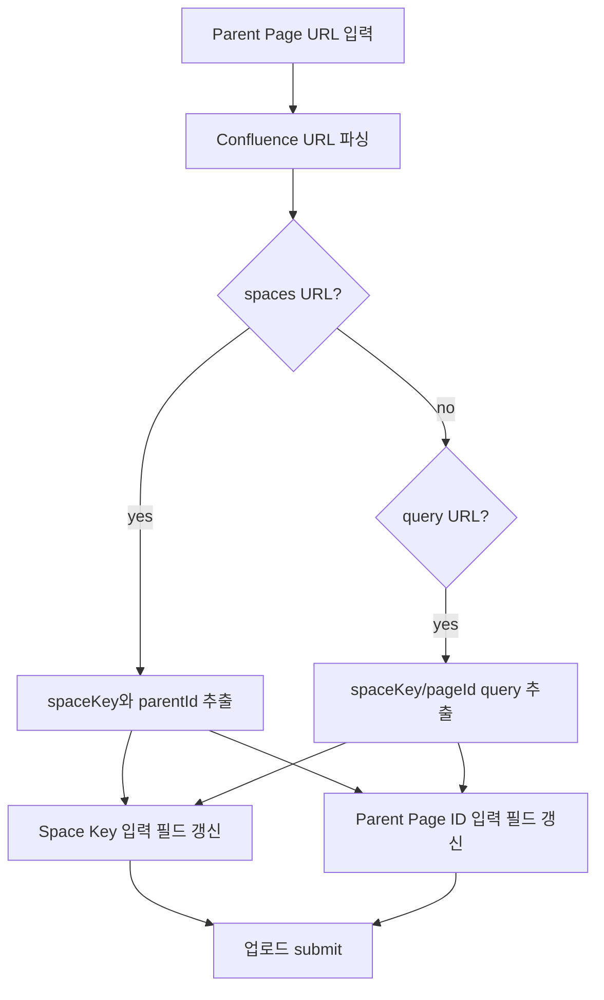

# Obsidian 업로드 Modal Parent URL 자동 채우기

## 배경

새 Confluence 페이지를 생성할 때 부모 페이지 URL을 알고 있어도 기존 UI에서는 Space Key와 Parent Page ID를 별도로 입력해야 했다. Parent Page ID 입력칸에 URL을 넣는 임시 동작은 page id만 추출하므로 Space Key 자동 입력이 되지 않았다.

## 변경 설계



## UI 동작

| 필드 | 역할 |
|---|---|
| `Parent Page URL` | 부모 페이지 URL을 붙여넣는 전용 입력 |
| `Space Key` | URL 파싱 성공 시 자동 갱신되며 직접 수정 가능 |
| `Parent Page ID` | URL 파싱 성공 시 자동 갱신되며 직접 수정 가능 |

지원 URL 예시:

| 형식 | 추출 결과 |
|---|---|
| `/spaces/<SPACE>/pages/<PAGE_ID>/<title>` | `spaceKey=<SPACE>`, `parentId=<PAGE_ID>` |
| `/pages/viewpage.action?pageId=<PAGE_ID>&spaceKey=<SPACE>` | `spaceKey=<SPACE>`, `parentId=<PAGE_ID>` |

## 검증

| 검증 항목 | 명령 |
|---|---|
| URL parser 단위 테스트 | `pnpm --dir packages/obsidian-plugin test -- --run tests/confluence-url.test.ts` |
| Obsidian plugin production build | `pnpm --dir packages/obsidian-plugin build` |

## 신규 페이지 제목 중복 경고

새 페이지를 생성할 때 Confluence는 같은 Space 안에 동일한 제목의 페이지 생성을 허용하지 않는다. 기존에는 `createPage` 요청 이후 Confluence의 원문 400 error가 그대로 노출되어 사용자가 파일 이름을 바꿔야 하는지 알기 어려웠다.

```mermaid
flowchart TD
  A[Obsidian 신규 페이지 업로드] --> B[파일 basename을 Confluence title로 결정]
  B --> C[getPageByTitle(spaceKey, title)]
  C --> D{동일 title 존재?}
  D -->|yes| E[업로드 중단 및 파일 이름 변경 안내]
  D -->|no| F[createPage 호출]
  F --> G{400 duplicate title?}
  G -->|yes| E
  G -->|no| H[이미지 attachment 업로드 및 frontmatter 갱신]
```

| 상황 | 동작 |
|---|---|
| `confluence_page_id`가 있는 기존 페이지 업데이트 | 제목 중복 사전 검사를 수행하지 않고 기존 업데이트 흐름 유지 |
| 신규 페이지 업로드 전 동일 title 발견 | `이미 '<title>' 페이지가 '<spaceKey>' Space에 존재합니다. Obsidian 파일 이름을 바꾼 뒤 다시 업로드하세요.` 표시 |
| 신규 페이지 생성 중 Confluence 400 duplicate title 발생 | 같은 한국어 안내로 변환 |

검증 명령:

| 검증 항목 | 명령 |
|---|---|
| 제목 중복 utility 단위 테스트 | `pnpm --dir packages/obsidian-plugin test -- --run tests/page-title.test.ts` |
| Obsidian plugin production build | `pnpm --dir packages/obsidian-plugin build` |
