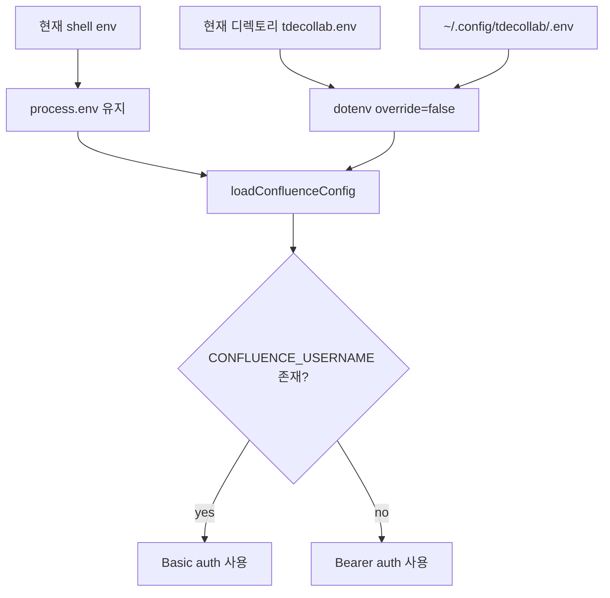

# CLI Confluence 401 인증 오류 진단

## 현상

`pnpm cli confluence page get 1028471031` 실행 시 Confluence가 `401 Basic Authentication Failure`를 반환했다.

## 원인

환경변수 로딩 우선순위는 다음과 같다.



현재 shell env에는 `CONFLUENCE_API_TOKEN`만 있었지만, `~/.config/tdecollab/.env`에 `CONFLUENCE_USERNAME`이 남아 있었다. 그 결과 CLI가 PAT Bearer 인증이 아니라 Basic 인증을 사용했고, Confluence가 401을 반환했다.

| 값 | 상태 |
|---|---|
| `CONFLUENCE_BASE_URL` | shell 또는 global env에서 설정됨 |
| `CONFLUENCE_API_TOKEN` | shell env 값이 우선 적용됨 |
| `CONFLUENCE_USERNAME` | `~/.config/tdecollab/.env`에서 추가 로드됨 |
| 최종 인증 방식 | Basic auth |

## 임시 우회

```bash
CONFLUENCE_USERNAME= pnpm cli confluence page get 1028471031 --quiet --output /private/tmp/page-test-002.md
```

## 권장 조치

PAT Bearer 인증을 사용할 경우 `~/.config/tdecollab/.env`에서 `CONFLUENCE_USERNAME`을 제거하거나 주석 처리한다.

```bash
# CONFLUENCE_USERNAME=1111812
CONFLUENCE_API_TOKEN=...
```

## 추가 수정

인증을 Bearer로 맞추자 Markdown 변환 경로에서 `require is not defined`가 발생했다. `storage-to-md.ts`는 이미 `JSDOM`을 ESM import하고 있으므로, Node 경로에서도 import된 `JSDOM`을 사용하도록 수정했다.

## 검증

| 검증 항목 | 결과 |
|---|---|
| `CONFLUENCE_USERNAME=` 상태 raw get | 성공 |
| `CONFLUENCE_USERNAME=` 상태 Markdown get | 성공 |
| `pnpm test:run tools/confluence/converters/__tests__/storage-to-md.spec.ts` | 통과 |
| `pnpm test:run tests/confluence/converters/storage-to-md.test.ts` | 통과 |
| `pnpm build` | 통과 |
