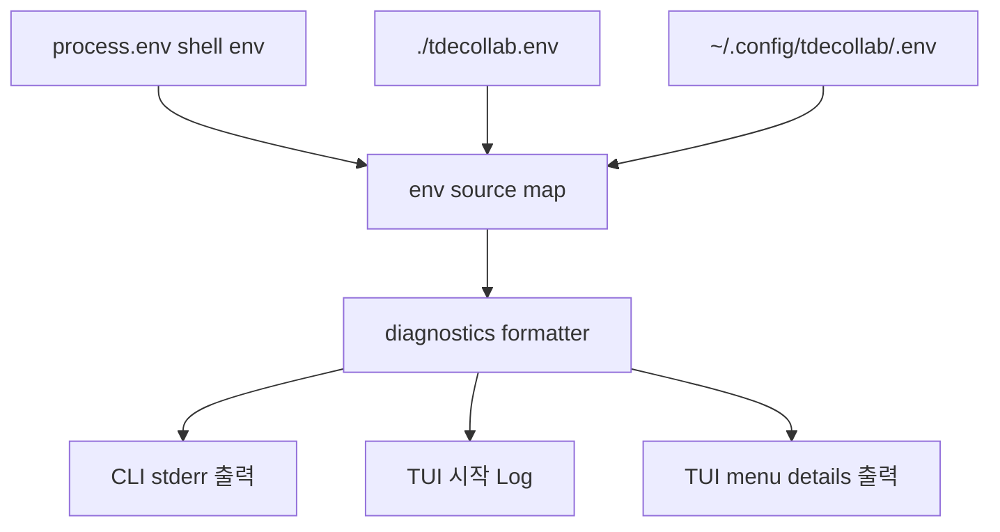

# CLI/TUI 설정 로딩 진단 출력

## 배경

CLI와 TUI 실행 시 `CONFLUENCE_USERNAME`, token, `.env` 파일 우선순위가 섞이면 실제 인증 방식이 예상과 달라질 수 있다. 특히 TUI를 주로 사용할 때 어떤 설정값이 어느 source에서 들어왔는지 바로 확인할 수 있어야 한다.

## 설계

## 출력 내용

| 항목 | 정책 |
|---|---|
| loaded/skipped file | 실제 로드/스킵된 env 파일 경로 출력 |
| `CONFLUENCE_*`, `JIRA_*`, `GITLAB_*`, AI 설정 | 값과 source 출력 |
| token/key | 앞 4글자, 뒤 4글자, 길이만 출력 |
| Confluence auth mode | `CONFLUENCE_AUTH_TYPE` 기준 최종 `Bearer`/`Basic` 출력 |

CLI는 command 본문 stdout과 섞이지 않도록 stderr에 출력한다. TUI는 session 시작 Log와 첫 menu details 화면에 출력한다.

## 검증

| 검증 항목 | 명령 |
|---|---|
| env source tracking | `pnpm test:run tests/common/env-loader.test.ts tests/common/config-diagnostics.test.ts` |
| CLI 실제 출력 | `pnpm cli confluence page get 1028471031 --raw --quiet --output /private/tmp/tdecollab-config-diagnostics-check.xml` |
| build | `pnpm build` |
