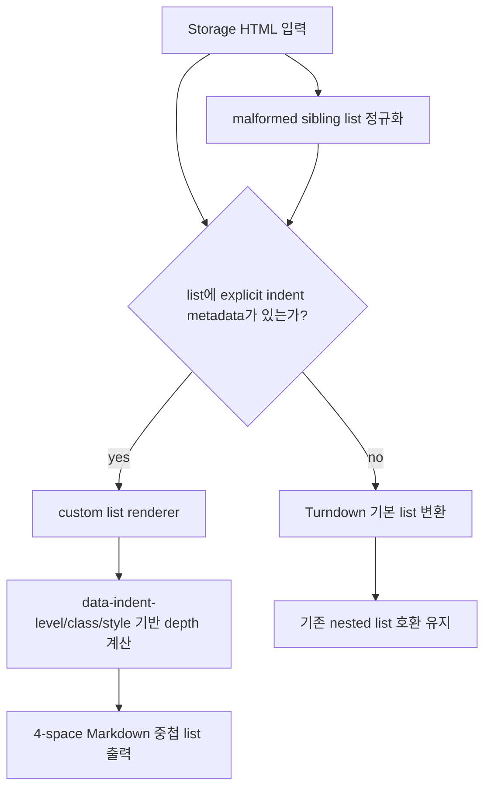

# Confluence 다운로드 List 들여쓰기 보존

## 배경

Confluence 페이지를 CLI 또는 Obsidian plugin으로 다운로드할 때, 원본 페이지에서는 하위 bullet로 표시되는 항목이 Markdown에서는 모두 1레벨 list로 풀리는 문제가 있었다.

대상 예시:

| 항목 | 값 |
|---|---|
| Page ID | `928506245` |
| URL | `https://confluence.tde.sktelecom.com/spaces/VA/pages/928506245/01.+System+Diagram+-+CoreACS+dev+perspective` |
| 로컬 파일 | `files/download/lucian01.md` |

## 원인

Confluence storage는 페이지 작성 방식에 따라 두 종류의 list 표현을 만들 수 있다.

| storage 형태 | 기존 변환 결과 |
|---|---|
| 실제 nested `<ul><li>...<ul>...` 구조 | Turndown 기본 변환이 depth를 보존하지만 공백과 빈 줄이 많음 |
| flat `<ul>` 내부의 `<li data-indent-level="...">` metadata | Turndown이 metadata를 무시하여 모든 항목이 1레벨로 변환 |
| malformed `<li>항목</li><ul>하위 항목</ul>` sibling 구조 | JSDOM/Turndown 처리 중 하위 list가 sibling으로 풀려 1레벨로 변환 |

문제가 된 페이지는 세 번째 구조였다. Confluence storage에서 하위 `<ul>`이 직전 `<li>`의 자식이 아니라 같은 parent의 sibling으로 내려왔다.

## 변경 설계

## 지원 metadata

| source | 예시 | 변환 |
|---|---|---|
| `data-indent-level` | `<li data-indent-level="2">` | depth 2 |
| `data-indent` | `<li data-indent="2">` | depth 2 |
| `data-level` | `<li data-level="2">` | depth 2 |
| class | `ql-indent-2`, `indent-2` | depth 2 |
| style | `margin-left: 80px` | 40px 단위로 depth 추정 |

## 검증

| 검증 항목 | 명령 |
|---|---|
| storage-to-md 중첩 list 단위 테스트 | `pnpm test:run tools/confluence/converters/__tests__/storage-to-md.spec.ts` |
| root storage-to-md 회귀 테스트 | `pnpm test:run tests/confluence/converters/storage-to-md.test.ts` |
| root build | `pnpm build` |
| Obsidian plugin build | `pnpm --dir packages/obsidian-plugin build` |
| 실제 페이지 재다운로드 | `pnpm cli confluence page get 'https://confluence.tde.sktelecom.com/spaces/~1111812/pages/1028471031/PAGE_TEST_002' --quiet --output files/download/lucian01.md` |
