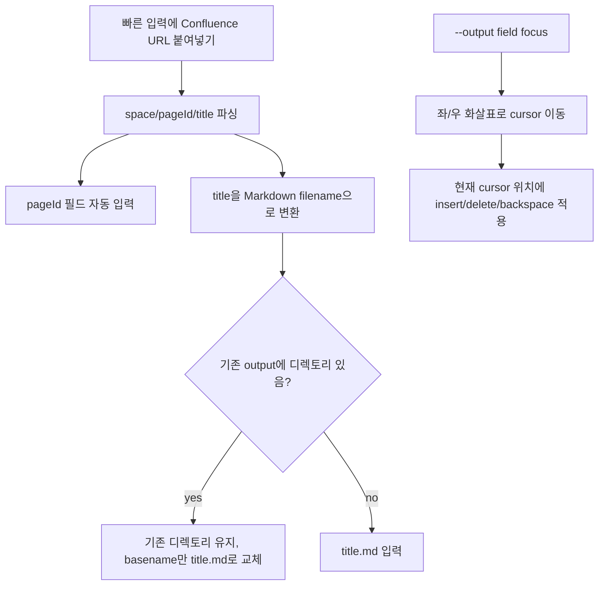

# TUI Page Get URL 기반 Output 자동 입력과 Cursor Editing

## 배경

TUI에서 Confluence page get을 사용할 때 URL을 붙여넣으면 `pageId`는 자동 입력되지만, 저장 파일명은 사용자가 직접 입력해야 했다. 또한 `--output` 입력 필드는 항상 문자열 끝에만 입력되므로 파일명을 일부 수정하려면 backspace로 끝에서부터 지워야 했다.

## 변경 설계

## 동작

| 상황 | 결과 |
|---|---|
| `https://.../pages/1028471031/PAGE_TEST_002` 입력 | `pageId=1028471031`, `output=PAGE_TEST_002.md` |
| 기존 output이 `files/download/lucian01.md`인 상태에서 URL 입력 | `files/download/PAGE_TEST_002.md` |
| `--output` 입력 중 `←/→` 사용 | field focus 이동이 아니라 cursor 이동 |
| 중간 위치에서 문자 입력 | cursor 위치에 삽입 |
| 중간 위치에서 backspace/delete | cursor 앞/현재 문자 삭제 |

## 검증

| 검증 항목 | 명령 |
|---|---|
| URL parser/fill | `pnpm test:run tests/tui/url-parser.test.ts` |
| text edit utility | `pnpm test:run tests/tui/text-edit.test.ts` |
| TUI build 포함 root build | `pnpm build` |
