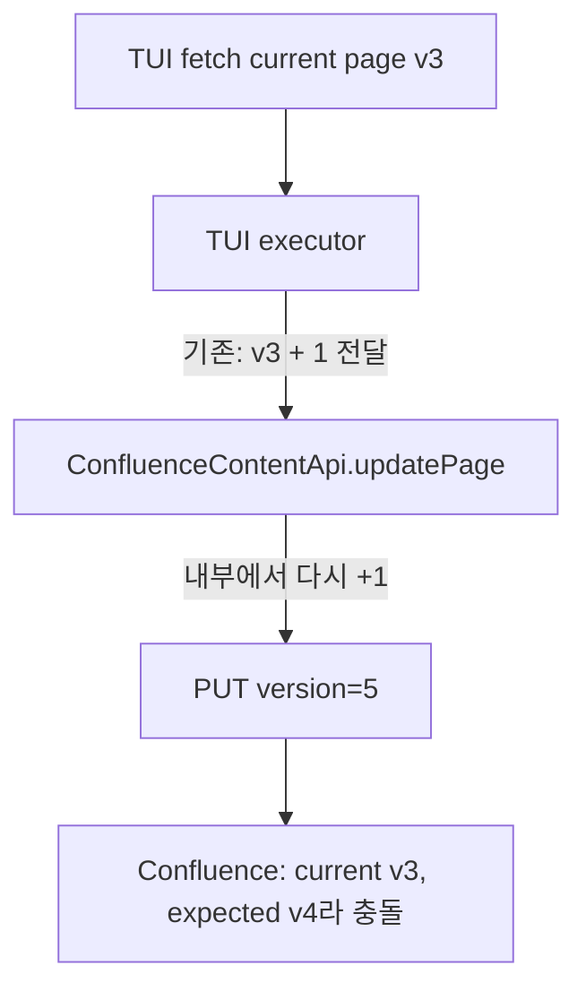
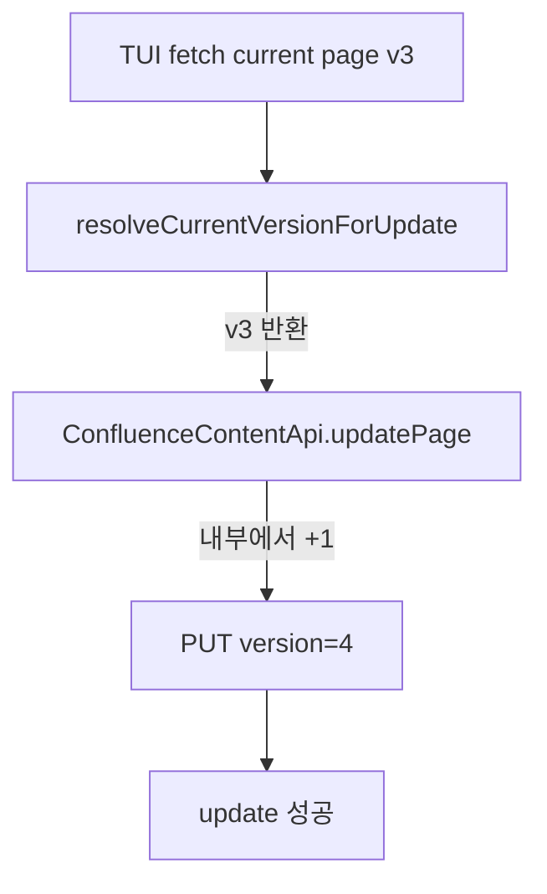

# TUI Confluence Update Version 충돌 수정

## 현상

TUI에서 `confluence page update` 실행 시 Confluence가 다음 오류를 반환했다.

```text
충돌 발생: Version must be incremented on update. Current version is: 3.
```

## 원인

`ConfluenceContentApi.updatePage()`는 호출자가 현재 version을 넘기면 내부에서 `+1`을 적용해 Confluence update payload를 만든다.



CLI/MCP/Obsidian 경로는 현재 version을 그대로 전달하고 있었고, TUI만 next version을 전달했다.

## 수정

TUI executor가 `updatePage()`에 현재 version을 그대로 전달하도록 수정했다.



## 검증

| 검증 항목 | 명령 |
|---|---|
| version utility 단위 테스트 | `pnpm test:run tests/confluence/utils/version.test.ts` |
| root build | `pnpm build` |
| Obsidian plugin build | `pnpm --dir packages/obsidian-plugin build` |

참고: `tests/confluence/api/content.test.ts`는 기존 label URL 기대값 차이(`/rest/...` vs `rest/...`)로 실패한다. 이번 version fix와 직접 관련 없는 기존 테스트 이슈다.
