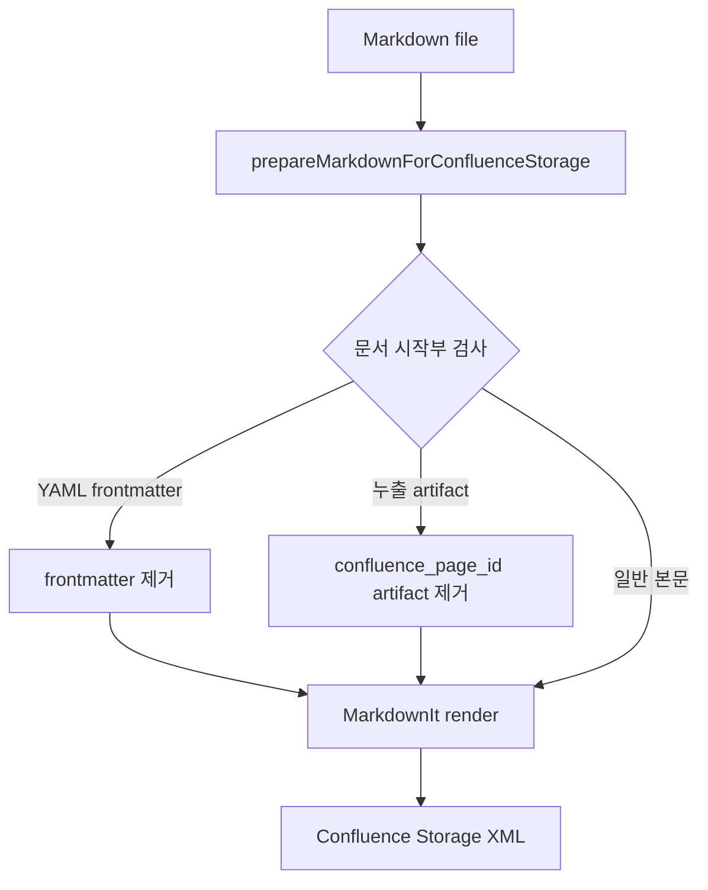

# Confluence Frontmatter Roundtrip 방지

## 배경

Obsidian plugin은 로컬 Markdown 파일 관리를 위해 `confluence_page_id`를 YAML frontmatter에 저장한다. 이 frontmatter가 Confluence upload/update 시 본문으로 전달되면 Confluence Storage 변환 과정에서 `---`는 horizontal rule로, `confluence_page_id`는 heading으로 저장된다.

이후 같은 페이지를 CLI/TUI/Obsidian에서 다시 download/upload/update 하면 로컬 property와 Confluence 본문 artifact가 섞여 `---`와 `confluence_page_id` 표시가 반복적으로 남을 수 있다.

## 처리 원칙

| 항목 | 결정 |
|---|---|
| 로컬 property 저장 | Obsidian Markdown frontmatter에 유지 |
| Confluence 본문 저장 | `confluence_page_id` frontmatter는 저장하지 않음 |
| 적용 위치 | `MarkdownToStorageConverter` 공통 전처리 |
| 적용 범위 | CLI, TUI, MCP, Obsidian plugin upload/update |
| 기존 누출 artifact | 문서 맨 앞의 `---` + `## confluence_page_id` 형태만 제거 |

## 흐름

## 기대 효과

- Obsidian property는 로컬 파일에만 남는다.
- CLI/TUI/Obsidian/MCP 어느 경로로 upload/update 해도 `confluence_page_id`가 Confluence 본문으로 올라가지 않는다.
- 이미 누출된 페이지도 다음 update 시 문서 시작부의 알려진 artifact가 제거된다.
- 본문 중간의 정상 `---` horizontal rule은 유지된다.
