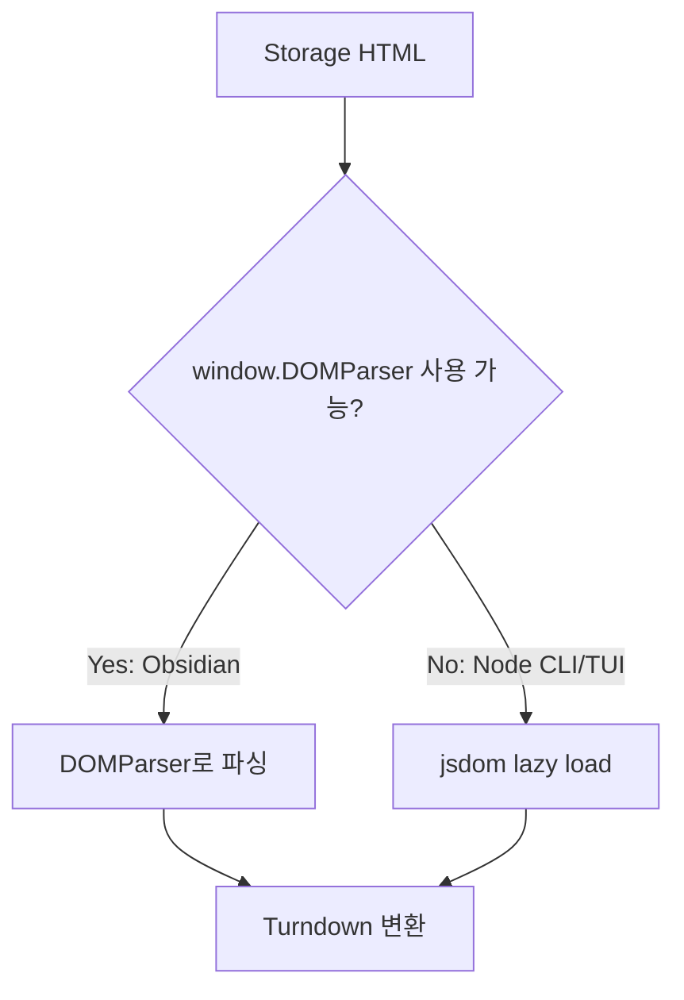

# Obsidian Plugin jsdom Runtime Load 방지

## 배경

Obsidian plugin을 disable 후 enable 할 때 다음 오류가 발생했다.

```text
Plugin failure: obsidian-tdecollab-dev Error: Cannot find module 'jsdom'
```

`StorageToMarkdownConverter`가 `jsdom`을 top-level import 하고 있었고, Obsidian plugin esbuild 설정은 `jsdom`을 external로 유지한다. 그 결과 plugin 로드 시점에 Obsidian Electron renderer가 `require('jsdom')`를 실행하려고 하며 실패했다.

## 원인

| 구간 | 상태 |
|---|---|
| CLI/TUI Node runtime | DOMParser가 없어 `jsdom` 필요 |
| Obsidian Electron renderer | `window.DOMParser` 사용 가능 |
| 기존 구현 | top-level `import { JSDOM } from 'jsdom'` |
| 문제 | Obsidian plugin enable 시점에 `jsdom` require 발생 |

## 변경 방향



## 기대 효과

- Obsidian plugin 로드 시점에 `jsdom`을 require하지 않는다.
- CLI/TUI의 Node runtime에서는 기존처럼 `jsdom`을 사용한다.
- storage-to-md 변환 로직은 기존 API를 유지한다.
