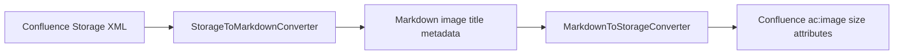

# Confluence Image Size Roundtrip 보존

## 배경

Confluence editor에서 이미지를 resize 하면 Storage XML의 `<ac:image>` 태그에 `ac:width`, `ac:height` 속성이 저장된다. 기존 Markdown download 변환은 이 속성을 버리고 ``만 생성했다. 이후 upload 시에는 size 속성이 없는 `<ac:image>`가 생성되어 Confluence에서 원본 이미지 full size로 표시됐다.

## 결정

Markdown 표준 이미지 문법에는 size 표현이 없다. 따라서 왕복 보존용 metadata를 Markdown image title에 저장한다.

| 방향 | 변환 |
|---|---|
| Confluence → Markdown | `<ac:image ac:width="320" ac:height="180">` → `` |
| Markdown → Confluence | `` → `<ac:image ac:width="320" ac:height="180">` |

## 흐름

## 기대 효과

- CLI/TUI/Obsidian download 후 upload/update 해도 Confluence image resize 정보가 유지된다.
- image download path mapping이 적용되어도 `width`/`height` metadata가 Markdown에 남는다.
- size metadata가 없는 일반 Markdown 이미지는 기존처럼 동작한다.
