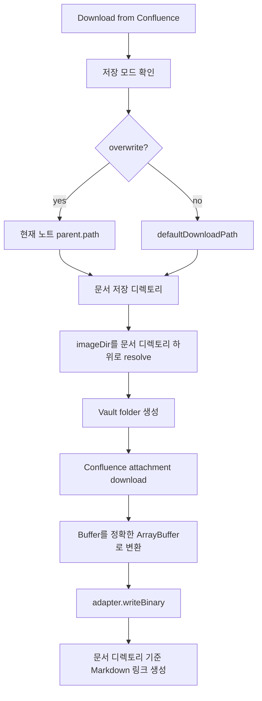

# Obsidian 이미지 다운로드 경로 및 0 byte 파일 수정

## 배경

Obsidian plugin의 Confluence 다운로드에서 다음 문제가 확인되었다.

| 문제              | 기존 동작                             | 수정 방향                                                    |
| --------------- | --------------------------------- | -------------------------------------------------------- |
| 이미지 저장 위치       | `assets/`가 vault root 하위에 생성됨     | 최종 Markdown 문서 저장 디렉토리 하위에 생성                            |
| Markdown 이미지 링크 | vault root 기준 상대 경로 사용            | 문서 디렉토리 기준 상대 경로 사용                                      |
| 이미지 파일 크기       | Obsidian plugin에서 0 byte 파일 생성 가능 | Obsidian `DataAdapter.writeBinary`에 정확한 `ArrayBuffer` 전달 |

## 수정 설계

CLI는 Node 파일 시스템에 직접 쓰는 `ImageDownloader`를 계속 사용한다. Obsidian plugin은 vault 내부 파일 쓰기 규칙을 따라야 하므로 plugin 전용 downloader를 분리한다.

## 검증

| 검증 항목 | 명령 |
|---|---|
| Obsidian image helper 단위 테스트 | `pnpm --dir packages/obsidian-plugin test -- --run tests/image-download.test.ts` |
| Obsidian plugin production build | `pnpm --dir packages/obsidian-plugin build` |
| 기존 CLI/shared downloader 회귀 테스트 | `pnpm test:run tests/confluence/utils/image-downloader.test.ts` |
