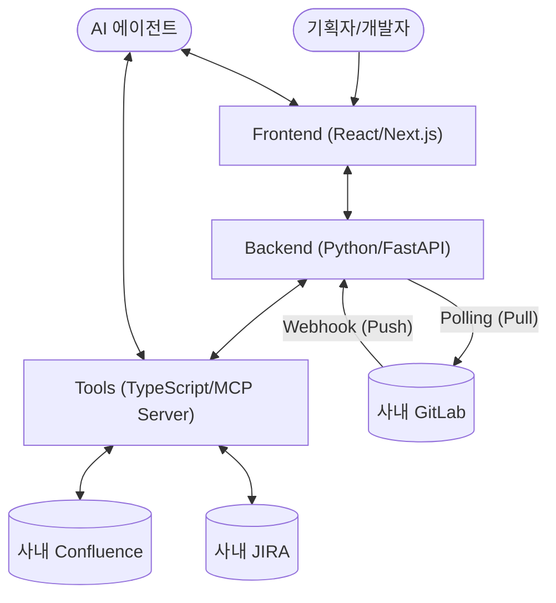

# Implementation Plan: Agentic PRD Harness

**Branch**: `001-agentic-prd-harness` | **Date**: 2026-04-17 | **Spec**: [Link to Spec](./spec.md)
**Input**: Feature specification from `tdecollab-docs/specs/001-agentic-prd-harness/spec.md`

## Summary

사내 On-Premise GitLab, Jira, Confluence를 활용하여 기획 문서(PRD)를 웹에서 대화형으로 정의하고 Confluence에 발행하며, 개발 Task를 분할해 JIRA 티켓으로 만들고 GitLab 이벤트를 통해 상태를 연동하는 Agentic AI 개발 하네스 구축. 기존 `src/` 모듈은 `tools/`로 역할을 재정의하여 MCP 래퍼로 작동하고, 백엔드는 Python으로 개발합니다.

## Technical Context

**Language/Version**: TypeScript (Frontend, Tools), Python 3.11+ (Backend)
**Primary Dependencies**: Next.js, FastAPI, @modelcontextprotocol/sdk
**Storage**: PostgreSQL (Backend DB)
**Testing**: pytest (Backend), vitest (Frontend, Tools)
**Target Platform**: Linux Server, Web Browser, MCP Client
**Project Type**: 웹 애플리케이션 (Frontend/Backend) 및 MCP Server
**Performance Goals**: API 응답 지연 최소화 및 실시간 상호작용 지원
**Constraints**: 클린 아키텍처, 헌장에 따른 문서화 및 컨텍스트 유지(`tdecollab-docs/`)

## 헌장 검토 (Constitution Check)

*GATE: 기획(Phase 0) 전에 통과해야 하며, 설계(Phase 1) 이후 재확인해야 합니다.*

- [x] **컨텍스트 유지 (Context Maintenance)**: `tdecollab-docs/`에 모든 설계 및 의사결정 문서가 작성되었습니까?
- [x] **코드 품질 및 가독성 (Code Quality)**: 재사용성과 가독성을 고려한 설계입니까?
- [x] **TDD (Test-Driven Development)**: 구현 전 테스트 코드 작성이 계획되어 있습니까?
- [x] **시각화 (Rich Documentation)**: Mermaid 다이어그램과 표를 활용하여 설계가 시각화되었습니까?
- [x] **클린 아키텍처 (Clean Architecture)**: 역할과 경계가 명확하며 중복이 없는 설계입니까?

## 아키텍처 시각화 (Mermaid)



## Project Structure

### Documentation (this feature)

```text
tdecollab-docs/specs/001-agentic-prd-harness/
├── plan.md              # This file
├── research.md          # Phase 0 output
├── data-model.md        # Phase 1 output
├── quickstart.md        # Phase 1 output
├── contracts/           # Phase 1 output
└── tasks.md             # Phase 2 output
```

### Source Code (repository root)

```text
tools/                   # (이전 src/) 사내 시스템 연계용 Tool & MCP
├── confluence/
├── jira/
├── gitlab/
├── mcp/
└── index.ts

backend/                 # Python/FastAPI 기반 백엔드 (신규)
├── app/
│   ├── api/             # 엔드포인트 및 라우터
│   ├── core/            # 비즈니스 로직 및 AI 연동
│   ├── models/          # 데이터 모델
│   └── webhooks/        # GitLab 연동
└── tests/

frontend/                # React/Next.js 기반 웹 UI (신규)
├── src/
│   ├── components/      # UI 컴포넌트
│   ├── pages/           # 웹 페이지
│   └── services/        # 백엔드 API 호출
└── tests/
```

**Structure Decision**: Python 기반 백엔드와 Next.js 프론트엔드를 별도로 분리하고, 기존 기능은 `tools/` 로 이름을 변경하여 MCP 프로젝트로서의 정체성을 강화하는 통합 모노레포 구조를 구성합니다.

## Complexity Tracking

| Violation | Why Needed | Simpler Alternative Rejected Because |
|-----------|------------|-------------------------------------|
| 다국어 모노레포 (Python + TS) | Python의 강력한 AI 생태계 활용과 기존 TS 기반 MCP 유지 | 모든 코드를 단일 언어로 재작성하기에는 기존 MCP 코드(`src/`)의 재사용성과 Python 생태계의 강점(AI, 데이터 처리 등) 양쪽의 이점을 포기해야 하므로, 역할에 맞게 분리하는 클린 아키텍처를 선택했습니다. |
