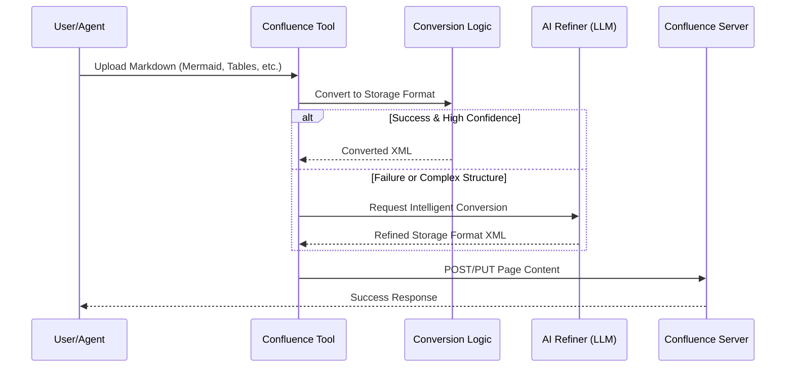

# Feature Specification: Confluence Tool Enhancement (Advanced MD Conversion)

**Confluence Link**: `[LINK_TO_CONFLUENCE]`  
**JIRA Epic/Ticket**: `[JIRA_TICKET_ID]`  
**Feature Branch**: `002-confluence-tool-enhancement`  
**Created**: 2024-05-24  
**Status**: Draft  
**Input**: Confluence로 markdown 파일을 upload 하면 mermaid diagram 이나 code 등이 block 으로 올라가지 않는 현상이나, page 의 table 이 markdown 의 table 로 잘 만들어지지 않고 HTML 로 들어오는 점 등이 문제가 있다. code 로 convert 하기 어려운 경우, ai agent 를 설정하여 ai 를 거쳐 convert 하도록 하는 기능 고도화가 되어야 한다.

> **Note**: 본 문서는 `tdecollab-docs/specs/002-confluence-tool-enhancement/spec.md`에 저장됩니다. 헌장에 따라 설계 과정에서 Mermaid 다이어그램과 표를 적극적으로 활용하십시오.

## User Scenarios & Testing *(mandatory)*

### User Story 1 - 지능형 Markdown → Confluence 업로드 (Priority: P1)

AI 에이전트가 Markdown 문서를 Confluence로 업로드할 때, Mermaid 다이어그램과 코드 블록이 Confluence 전용 매크로로 정확히 변환되어 시각적으로 완벽하게 렌더링되어야 합니다.

**Why this priority**: AI 에이전트가 작성한 기술 문서를 Confluence에서 바로 읽을 수 있게 하는 핵심 기능입니다.

**Independent Test**: Mermaid 다이어그램과 복잡한 코드 블록이 포함된 Markdown 파일을 업로드하고, Confluence 상에서 매크로가 정상 작동하는지 확인합니다.

**Acceptance Scenarios**:

1. **Given** Mermaid 다이어그램이 포함된 MD 파일, **When** Confluence 페이지 생성/수정 요청 시, **Then** Confluence에서 'Mermaid' 매크로로 변환되어 시각화됨.
2. **Given** 다양한 프로그래밍 언어의 코드 블록이 포함된 MD 파일, **When** 업로드 시, **Then** Confluence 'Code Block' 매크로가 적용되어 신택스 하이라이팅이 지원됨.

---

### User Story 2 - 정확한 표(Table) 변환 (Priority: P2)

Confluence 페이지를 읽어올 때, 복잡한 레이아웃의 표도 HTML 태그가 아닌 순수 Markdown 표 형식으로 변환되어 에이전트가 이해하기 쉬워야 합니다.

**Why this priority**: 문서의 구조적 정보를 유지하여 AI 에이전트의 데이터 처리 능력을 높입니다.

**Independent Test**: 복잡한 셀 병합이나 포맷이 포함된 Confluence 표를 읽어와서 유효한 Markdown 표 형식이 생성되는지 확인합니다.

**Acceptance Scenarios**:

1. **Given** Confluence의 표준 표, **When** 페이지 조회 시, **Then** HTML <table> 대신 Markdown `|---|` 형식으로 반환됨.

---

### User Story 3 - AI 기반 폴백(Fallback) 변환 (Priority: P3)

정규표현식이나 단순 파싱으로 변환이 어려운 복잡한 구조의 경우, 설정된 AI 에이전트를 호출하여 지능적으로 형식을 변환합니다.

**Why this priority**: 예외 상황에서도 변환 품질을 보장하여 사용자 경험을 완성합니다.

**Independent Test**: 고의로 망가뜨린 표나 변칙적인 다이어그램 구문을 포함시키고, AI 에이전트가 이를 감지하여 올바른 형식으로 교정하는지 확인합니다.

**Acceptance Scenarios**:

1. **Given** 기존 변환 로직이 실패하는 복잡한 컨텐츠, **When** AI 폴백 옵션이 켜져 있을 때, **Then** LLM을 거쳐 최종적으로 올바른 Confluence Storage Format으로 변환됨.

---

## 시각화 및 설계 (Visualization & Design)



## Requirements *(mandatory)*

### Functional Requirements

- **FR-001**: Markdown의 Mermaid 구문(```mermaid)을 Confluence Storage Format의 Mermaid 매크로 XML로 변환해야 한다.
- **FR-002**: Markdown 코드 블록을 언어 정보와 함께 Confluence Code Block 매크로로 변환해야 한다.
- **FR-003**: Confluence HTML Table을 Markdown Table 형식으로 역변환(Reverse-proxy/Get)할 때 HTML 태그를 제거하고 Markdown 문법을 적용해야 한다.
- **FR-004**: 환경 변수 또는 설정을 통해 AI 변환 에이전트(LLM API 등)를 연동할 수 있는 인터페이스를 제공해야 한다.
- **FR-005**: 규칙 기반 변환이 신뢰도가 낮거나 실패할 경우 AI 에이전트에게 변환 임무를 위임하는 폴백 메커니즘을 구현해야 한다.

### Key Entities *(include if feature involves data)*

| 엔티티 | 설명 | 주요 속성 |
|--------|------|-----------|
| Converter | Markdown과 Storage Format 간의 변환을 담당하는 모듈 | ruleSet, aiEnabled, targetVersion |
| AIProvider | 지능형 변환을 제공하는 LLM 인터페이스 | model, promptTemplate, apiKey |

## Success Criteria *(mandatory)*

### Measurable Outcomes

- **SC-001**: 표준 Mermaid 다이어그램의 Confluence 렌더링 성공률 100%.
- **SC-002**: 페이지 조회 시 반환되는 텍스트 내 HTML 태그(표 관련) 잔존율 0%.
- **SC-003**: AI 폴백 사용 시, 기존 실패 케이스의 90% 이상이 유효한 Confluence XML로 변환됨.

## Assumptions

- 사용자는 OpenAI, Anthropic 등의 LLM API 키를 가지고 있거나 내부 LLM 인프라를 사용할 수 있다고 가정한다.
- Confluence는 Mermaid 매크로가 설치되어 있거나 표준화된 방식으로 지원하는 버전임을 가정한다.
- 극도로 복잡한 셀 병합(Colspan, Rowspan)은 Markdown 표의 한계로 인해 일부 간소화될 수 있음을 인정한다.
